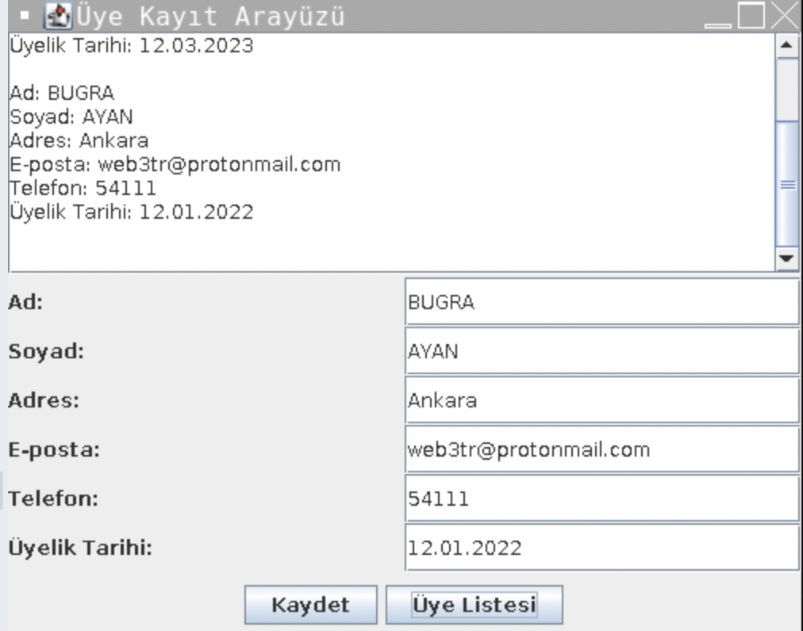

# Dernek Üye Yönetim Sistemi
Bu proje, derneklerin üye yönetimini kolaylaştırmak için tasarlanmış bir Java uygulamasıdır. Proje, üye kaydı, üye bilgilerini düzenleme, üyelik süresi takibi ve yönetici atama gibi temel işlevleri içermektedir. Ayrıca, Java Swing kullanarak basit bir kullanıcı arayüzü de bulunmaktadır.
## Kurulum
Bu projeyi kullanmak için, öncelikle bilgisayarınızda Java Development Kit (JDK) kurulu olması gerekir. Daha sonra, projeyi klonlayabilir veya indirebilirsiniz. Projeyi klonlamak için aşağıdaki komutu kullanabilirsiniz:

```
git clone https://github.com/kullaniciadi/dernek-uye-yonetim-sistemi.git

```



Alternatif olarak, projeyi indirmek için sağ üst köşedeki "Code" butonuna tıklayabilirsiniz. "Download ZIP" seçeneğini seçerek, projeyi bilgisayarınıza indirebilirsiniz.
## Kullanım
Proje klonlandıktan veya indirildikten sonra, `src` klasöründe bulunan `.java` dosyalarını derleyerek uygulamayı çalıştırabilirsiniz. Projeyi derlemek ve çalıştırmak için şu adımları izleyebilirsiniz:

1. Terminal veya komut istemi açın.
2. Projenin bulunduğu dizine gidin.
3. `javac *.java` komutunu kullanarak `.java` dosyalarını derleyin.
4. `java Main` komutunu kullanarak uygulamayı çalıştırın.


Uygulama başladığında, Java Swing kullanarak basit bir kullanıcı arayüzü açılacaktır. Arayüzde, "Yeni Üye Ekle" ve "Üye Listesi" olmak üzere iki düğme bulunmaktadır.

Yeni bir üye eklemek için, "Yeni Üye Ekle" düğmesine tıklayın ve formu doldurun. Formu doldurduktan sonra, "Kaydet" düğmesine tıklayarak yeni üyeyi kaydedebilirsiniz.

Kaydedilen üyeleri listelemek için, "Üye Listesi" düğmesine tıklayın. Üyelerin bilgileri, metin alanına yazdırılacaktır.
## Katkıda Bulunma
Bu proje açık kaynaklı bir projedir ve herkesin katkıda bulunması beklenmektedir. Projeyle ilgili herhangi bir hata veya sorun tespit ettiğinizde, lütfen bir sorun açın veya bir pull talebi gönderin.
## Lisans
Bu proje, MIT lisansı altında lisanslanmıştır. Daha fazla bilgi için `LICENSE` dosyasına bakın.
